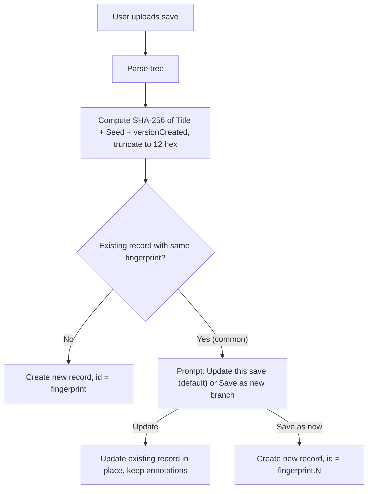

# Annotations and persistence (planned)

## Goal

Let users attach metadata that does not exist in the save file, such as which vessel was launched for which contract. Persist that data in the browser, export and import it as JSON, and keep the data model compatible with future ConfigNode embedding (for example via a KSP `ScenarioModule` or a companion mod).

## Scope (when implemented)

- **IndexedDB** – store save records and annotation rows keyed by save identity (see Save identity), not keyed by the full `.sfs` text.
- **Pinia store** – reactive annotations with CRUD actions, scoped to the active save record.
- **JSON export/import** – versioned bundle format for backup and moving between browsers or devices; merge strategy on import with user prompts on conflicts.
- **UI** – link vessels to contracts; optional notes and tags. Relational shapes (for example vessel plus contract grouping) are examples of what an annotation can represent; this roadmap does not prescribe a fixed annotation schema.

## Save identity

A **fingerprint** identifies one logical career save across uploads. Compute it from the parsed tree:

- **Fingerprint** = first **12 hex characters** of **SHA-256** over a normalized string: `"{trimmed GAME.Title}\n{GAME.Seed}\n{GAME.versionCreated}"` (or an equivalent deterministic concatenation). `GAME.Title` is already read in the app ([`src/save-file/save-file.util.js`](../../src/save-file/save-file.util.js)); `Seed` and `versionCreated` are standard stock KSP fields on the `GAME` node. Use the built-in `crypto.subtle.digest('SHA-256', …)`; no new dependency. Non-cryptographic hashes would also work (this is not adversarial), but the built-in is sufficient.

**Collision risk** at 48 bits: roughly one in 560 million even at an absurd 1000 save records per user, and roughly one in 220 billion at a more realistic 100. The update-vs-branch prompt below is the backstop for the near-impossible collision case.

On upload, compute the fingerprint and look up an existing save record.

- **Update this save** is the expected common path: players re-upload updated `persistent.sfs` snapshots for the same career often. UI copy should treat this as the default or primary action (for example “Update this save”), not as a destructive “overwrite.”
- **Update** refreshes the record’s metadata, optional cached blob (if implemented), and `lastSeenAt`; annotations stay attached to the same record.
- **Save as a new branch** creates a sibling record with no copied annotations; users can copy or re-link later if they want.

**Record IDs:** the first record for a fingerprint uses the 12-hex fingerprint as `id`. Sibling branches append **`.`** and a numeric index: `a3f9e2c4b017`, then `a3f9e2c4b017.1`, `a3f9e2c4b017.2`. Each row still stores the bare `fingerprint` field so lookups stay fingerprint-keyed while `id` stays unique.

Why **`.`** as delimiter: unreserved in URLs (RFC 3986), filesystem-safe, not in the hex alphabet, and not in base64url either (leaves room to change hash encoding later without breaking stored IDs). Reads like a branch or generation marker (`foo.1`, `foo.2`).

## Storage shape

**Tiered persistence:**

- Small UI preferences (filters, sorts, settings) → **`localStorage`** via a small Pinia persistence plugin. Synchronous hydration avoids a flash of default state. **Shipped for table prefs:** see [ADR-006](../adr/006-ui-prefs-persistence.md) and `ksp-explorer:save:*` keys in [`src/app/persist-ui-prefs.plugin.js`](../../src/app/persist-ui-prefs.plugin.js).
- Save records and annotations → **IndexedDB**.

Recommend **Dexie** as the IndexedDB client (schema, indexes on `fingerprint` and `saveId`, declarative migrations). This is a recommendation, not a locked choice; alternatives such as `idb` or raw IndexedDB are acceptable.

Minimum object stores to plan for:

- `saves` – fields such as `id`, `fingerprint`, optional `displayName`, `firstSeenAt`, `lastSeenAt`, `knownFileNames`.
- `annotations` – fields such as `id`, `saveId`, `schemaVersion`, `type`, `payload`, `createdAt`, `updatedAt`.

Optional future: `blobs` for cached `.sfs` text keyed by `saveId`. This is an open question; the non-goals section below still rules out replacing the user’s on-disk save from the web app.

## Reference model

Annotations point at entities inside the save using stable KSP identifiers captured at link time, with fallback chains when resolving against the current tree:

- Vessel: `pid` → `persistentId` → `name`.
- Contract: `guid` (ContractSystem; see [`src/ksp/contract-rescue.util.js`](../../src/ksp/contract-rescue.util.js)).
- Kerbal: `name` (de facto unique in the roster).
- Part (where relevant): `uid` (see [`src/save-file/save-derived.util.js`](../../src/save-file/save-derived.util.js)).

Each reference also stores a human-readable label and a small snapshot (for example vessel name, contract title) so dangling references stay understandable.

Resolution runs when a save is loaded. Dangling references are shown explicitly (for example banner plus per-row indicator), not removed silently.

## Export / import

- Single JSON bundle with a top-level `schemaVersion` and a shape such as `{ saves: [...], annotations: [...] }`.
- Individual annotation rows also carry their own `schemaVersion` so row-level migrations can proceed without bumping the bundle format every time.
- Import merge: match saves by `fingerprint`; match annotations by composite key (`saveId` + annotation `id`). Conflicts prompt the user (keep vs replace).
- Export/import is the primary cross-device “sync” path without login or a backend.

## Likely ADR topics

The following are worth capturing as one or more ADRs when implementation starts; this list does not prescribe how many ADRs to write:

- Client-side persistence and the `localStorage` / IndexedDB tiered split.
- Save identity: fingerprint definition (SHA-256 truncated to 12 hex), update-vs-branch flow, and the `fingerprint.N` ID scheme.
- Annotation reference model: multi-identifier foreign keys into save entities and dangling-reference UX.
- JSON export/import format and schema versioning.
- Optional opt-in caching of raw `.sfs` text, if the project revisits storing full file text in IndexedDB.

## Non-goals (for this feature)

- Replacing or auto-editing the user’s `persistent.sfs` on disk from the web app (possible later via `serialize()` in `ksp-confignode`; see that package’s roadmap).
- Committing to a fixed annotation type system or naming (for example a dedicated “mission” entity) in this roadmap; those belong in design or ADRs once the feature is scoped for implementation.

## Related

- [ADR-001](../adr/001-service-worker-offline.md) – Service worker and offline shell; client-side persistence complements precaching rather than replacing it.
- [ADR-004](../adr/004-confignode-parser.md) – Parser package and session-only parsed tree.
- [packages/ksp-confignode/docs/roadmap/serializer.md](../../packages/ksp-confignode/docs/roadmap/serializer.md) – Serializer for round-trip and mod interop.
